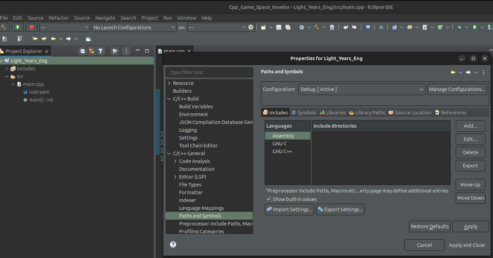

# Space Invader

## Table of Contents

- [Space Invader](#space-invader)
  - [Table of Contents](#table-of-contents)
  - [Context](#context)
  - [IDE and Build System](#ide-and-build-system)
  - [SFML](#sfml)
    - [Installation](#installation)
    - [Configuring SFML in Eclipse](#configuring-sfml-in-eclipse)

## Context

This repository document the project of building a space invader using `C++` and `SFML`.

<u>Goal</u>: 

I am working this game to practice my `C++` skills, theory and apply them into a concrete case.

## IDE and Build System

For this project we use [Eclipse IDE](https://eclipseide.org/) as our development tool to build and run the projects.

<u>Note:</u> For `C++` dev using `Eclipse`, see [C/C++ dev user guide](https://help.eclipse.org/latest/index.jsp)

## SFML

As a 3rd party library we use [`SFML`](https://www.sfml-dev.org/), to help handle game features such images, audio,...

### Installation

To install all `SFML`  modules (Graphics, Audio, Window, System, Network) at once, run the following command

<pre>sudo apt install libsfml-dev</pre>

To verify all modules are installed and working:

<pre>dpkg -l | grep sfml</pre>

<u>Note</u>: the `ii` we see at the start means the package is installed and working.

### Configuring SFML in Eclipse

To link the libraries dynamically in `Eclipse`, right click on the project, click `Properties` -> `C/C++ general` -> `Path and Symbols`-> `Libraries`, as shown in [Figure 1](#fig1)

<strong>Figure 1:</strong> Configuring SFML in Eclipse

Then add the following linker libraries:

<pre> "sfml-graphics" "sfml-audio" "sfml-window" "sfml-system" </pre>
